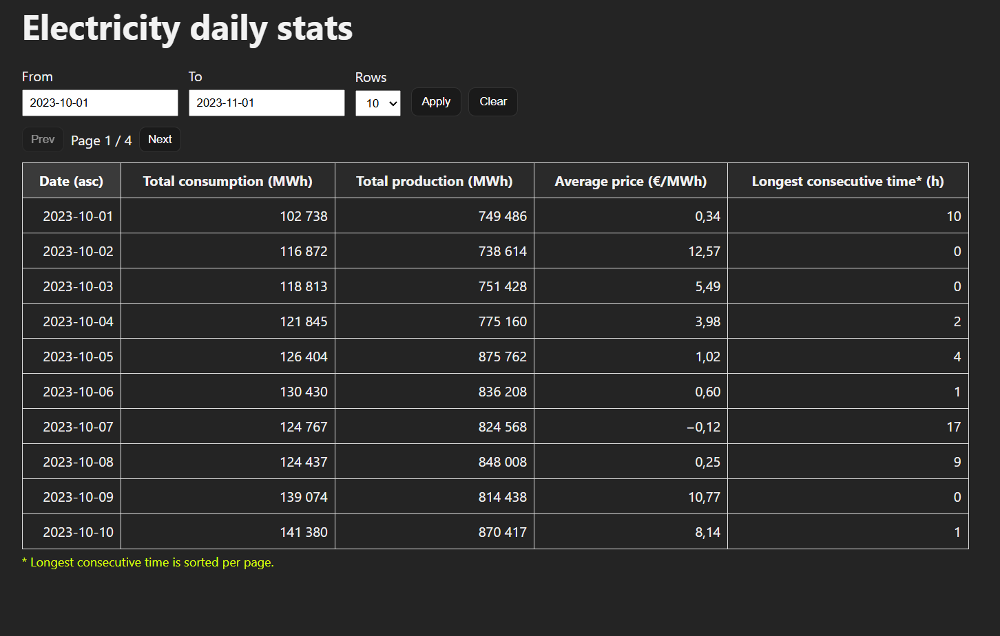

# ElectricityData

A simple web application that displays daily electricity statistics based on hourly data what is stored in PostgreSQL.

The backend gets the data per day and exposes a REST API.
The frontend displays the data in a table with the filtering, sorting, and pagination.

The focus of the project is on functionality, clarity, and understandable code rather than visual refinement.

## Features

Daily statistics:
Total electricity consumption per day
Total electricity production per day
Average electricity price per day
Longest consecutive period with negative electricity price

Pagination
Sorting by column
Date range filtering (from / to)

PostgreSQL database via Docker

## Tech Stack

Backend: Node.js, TypeScript, Express, PostgreSQL, Docker
Frontend: React, TypeScript, Vite
Visual studio code with the extensions: Prettier, REST Client, ESLint, Container Tools, Github Copilot
Stackoverflow & Google
ChatGPT

## Use of Generative AI Tools

Generative AI tools were used as support role during the development of this project.

ChatGPT was used mainly to get ideas, think through the implementation, and help organizing the project structure.

GitHub Copilot (Visual Studio Code extension) was used to assist while writing code. It was used to generate parts of the code, boilerplate, and function templates after I provided the needed information. In some cases Copilot completed fully the parts of the code, which are mentioned in comments.

All main logic, decisions, and final implementations were done and reviewed by me.

## Local development

### Clone the repository and follow the steps to run the project locally:

1. Start the Postgres DB (in the folder of database):

```bash
docker compose up -d
```

Url: http://localhost:8080

2. Start the backend (in the project root)

```bash
npm install
npm run dev
```

The backend runs on in the port 3000.
Url: http://localhost:3000

3. Start the frontend

```bash
cd frontend
npm install
npm run dev
```

Url: http://localhost:5173

## The API

GET /api/statistics

Query parameters:
page, limit
sort, order
from, to (YYYY-MM-DD)

For the example with the backend code:
/api/statistics?from=2024-09-01&to=2024-09-30&sort=average_price&order=desc

## Notes

- The longest negative price streak is calculated in the backend from hourly data.
- Sorting by the negative price streak is applied per page, since the value is computed after aggregation.
- When date filtering using, pagination defaults to returning all matching days (with a safe upper limit).

## Screenshot


